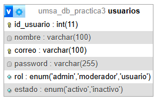
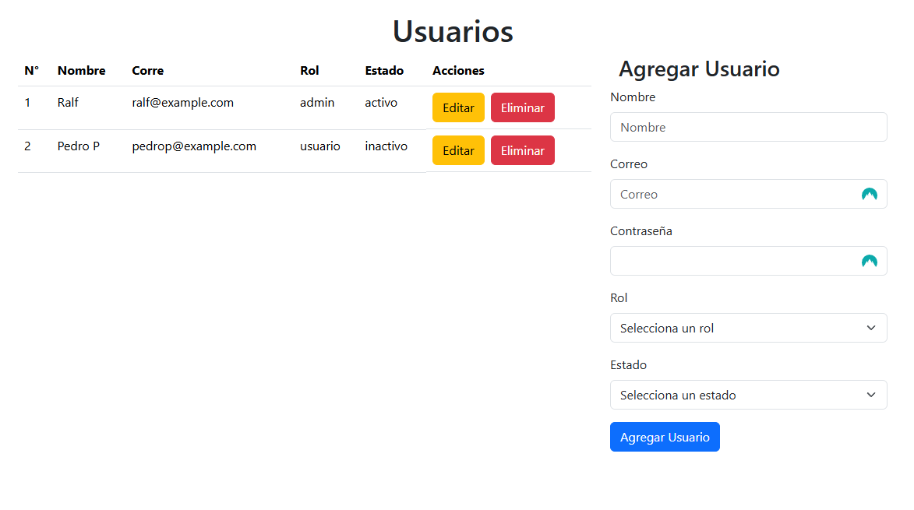

##Practica 3

Realizar un CRUD (Create, Read, Update, Delete) básico, para "Crear, Leer, Actualizar y Borrar" registros sobre una tabla, tomando en cuenta el patrón de diseño Modelo-Vista-Controlador. Lo anterior se tiene que realizar utilizando las herramientas de desarrollo Bootstrap y el NodeJS.

Para la tabla se utiliza la tabla usuarios

Donde la interfaz de realiza dentro una página realizando operaciones como crear, leer, actualizar y eliminar utilizando la función fetch para realizar consultas al servidor local. El resultado de la interfaz es la siguiente

