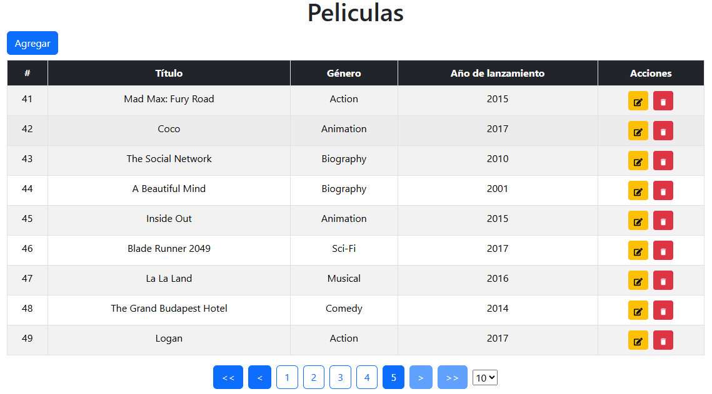
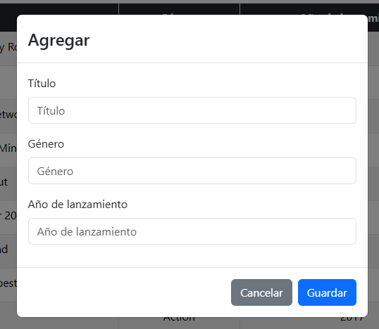
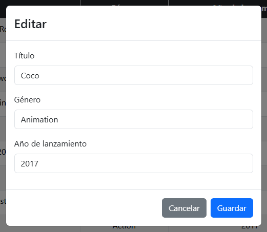

# Proyecto de CRUD basico con tecnologías NodeJS y React

El sitio web con crud basico se penso en realizar una base de datos en MySQL de peliculas con información de titulo, genero y año de lanzamiento.

## Tecnologías utilizadas

Para elaborar el proyecto se utiliza NodeJS y React ya mencionadas, donde para la parte visual se usa las siguientes dependencias:

- Boostrap
- Tanstack - react table
- React icons

La parte del formulario para agregar y editar se utiliza modal por parte de boostrap

Como de igual forma se utiliza un modal para confirmar la eliminación del dato

Los datos llamados por el backend son varios y para que se vea de forma amigable para el usuario se utiliza una paginación por parte de tanstack, donde se obtiene un resultado lo que se buscada limitando a 10 datos, con botones para cambiar cada pagina y mostrando en que pagina esta

